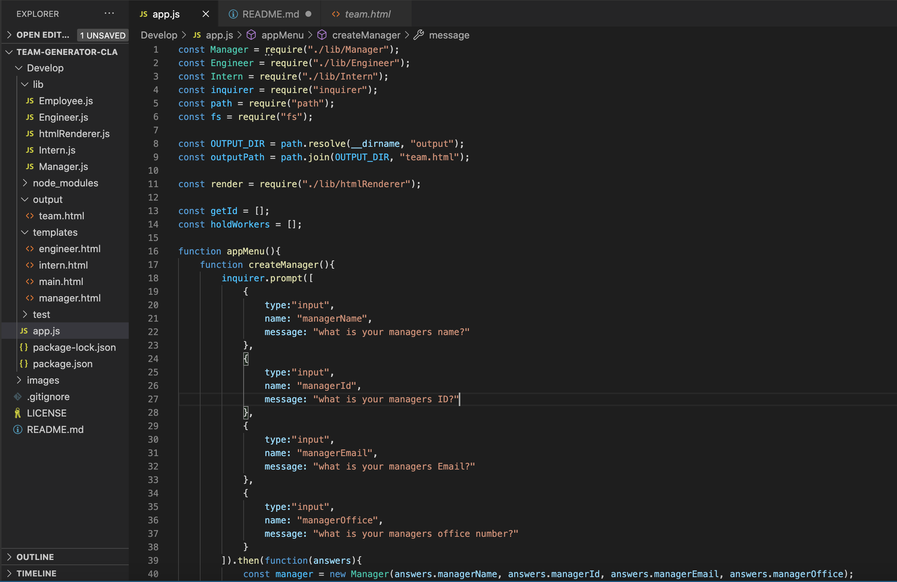
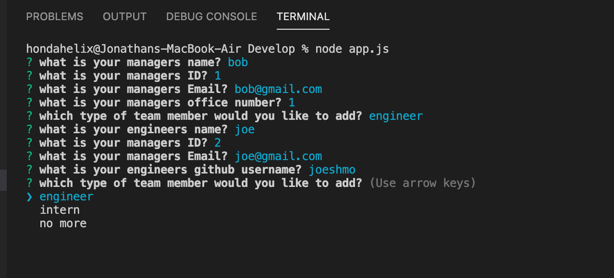

# team-generator-CLA

## Description 

This project is developed as a command-line application that prompts the user about team members and their information, generating an HTML webpage that displays said the report. 

This project enabled me to improve further my knowledge of using nodes and utilizing classes in javascript. Furthermore, this also helped me experience tests and their uses when developing programs. The tests were run through jest and ensured that my classes were appropriately written. 

## Table of Contents
* [Installation](#installation)
* [Usage](#usage)
* [Credits](#credits)
* [License](#license)
   
## Installation

The installation of this project is to access my github repository and then click on team-generator-CLA or click this link [team-generator-CLA](https://github.com/hondahelix/team-generator-CLA) then click on the green code button in the top right corner. Then you can copy and paste the code via ssh or by downloading a zip file. Once you have downloaded the file there are a couple of things that must be downloaded in order for this application to run properly. The first is node.js once this is downloaded open up the terminal and navigate to the file that this project is saved in. Then run the code:
npm i 
This should download inquire. Then all that is left to do is run the command:
node app.js 
Then you will be prompted with some questions in order to fill out and create the team cards.

## Usage 

This project's usage is to have an application that makes a web page quickly that displays the workers and members in a programming team. 

                        app.js

                        command-line

        
   
## Credits

Third party applications and instruction was provided by the University of California Berkeley' full stack Coding Bootcamp program as well as the utilization of node.js, inquirer and jest. 

[UCB Coding Bootcamp](https://bootcamp.berkeley.edu/coding/)   
[Node.js](https://https://nodejs.org/en/)     
[Inquirer](https://www.npmjs.com/package/inquirer)
[Jest](https://www.npmjs.com/package/jest)   

## License

 MIT

## Badges

## Tests

Fourteen tests were run using jest to ensure that the classes had the necessary elements and functi

                Tests
